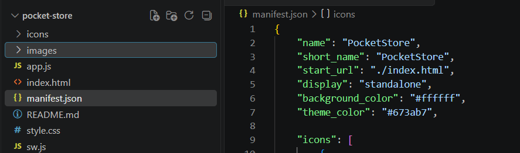
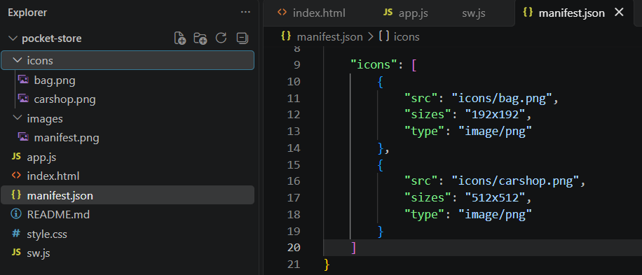
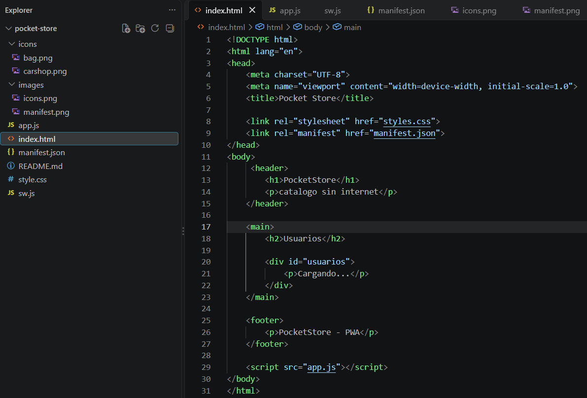
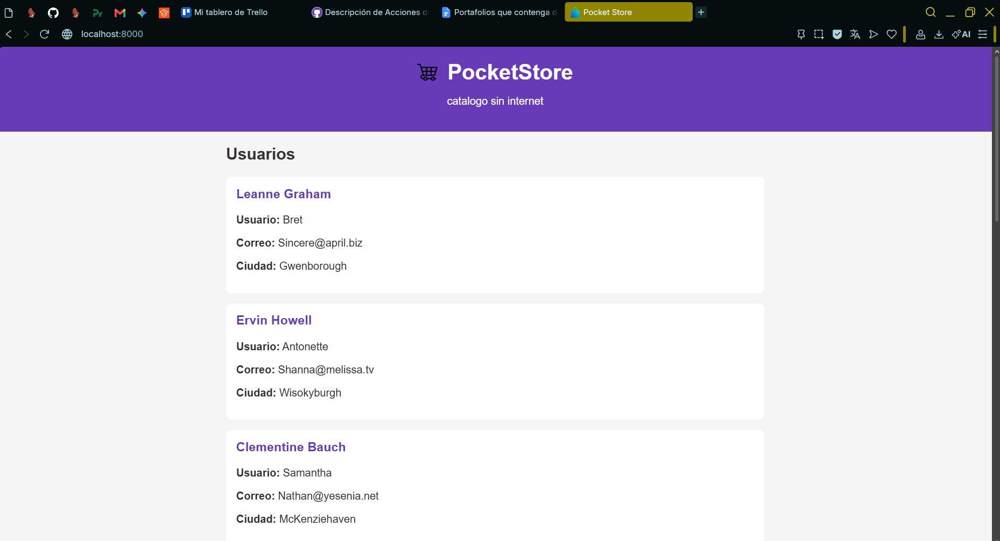
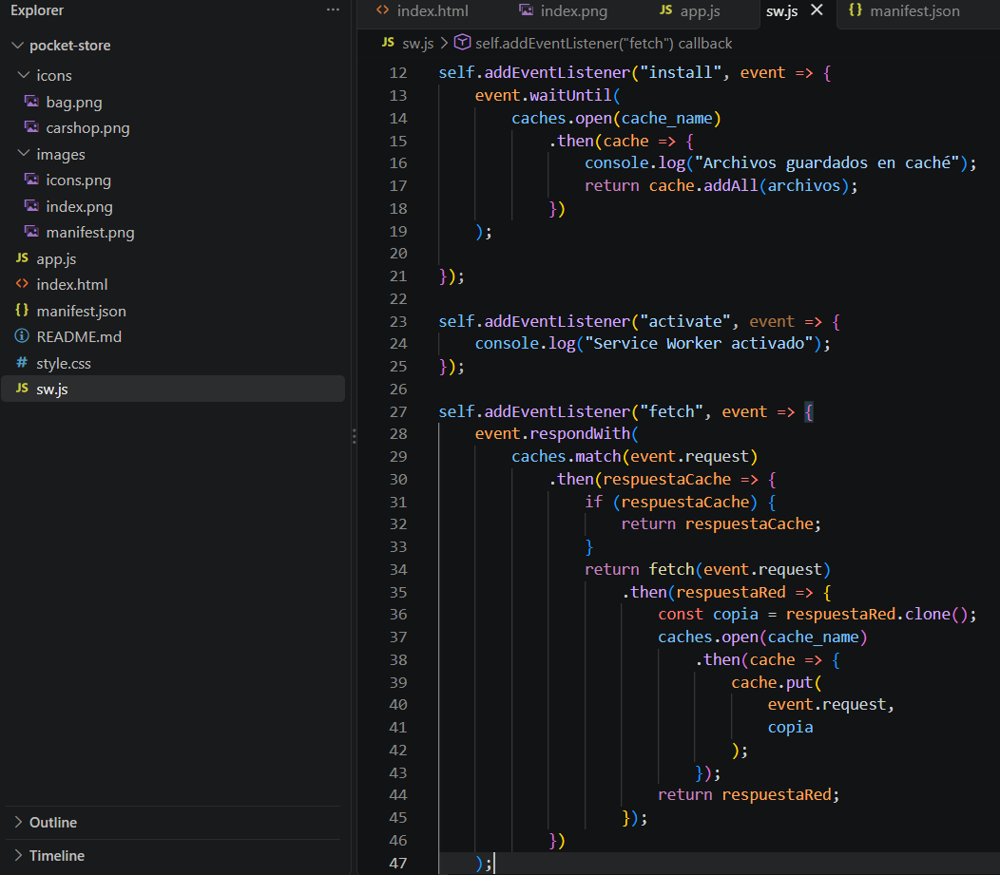
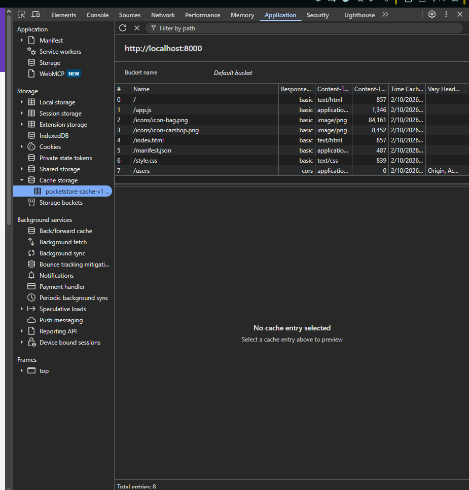
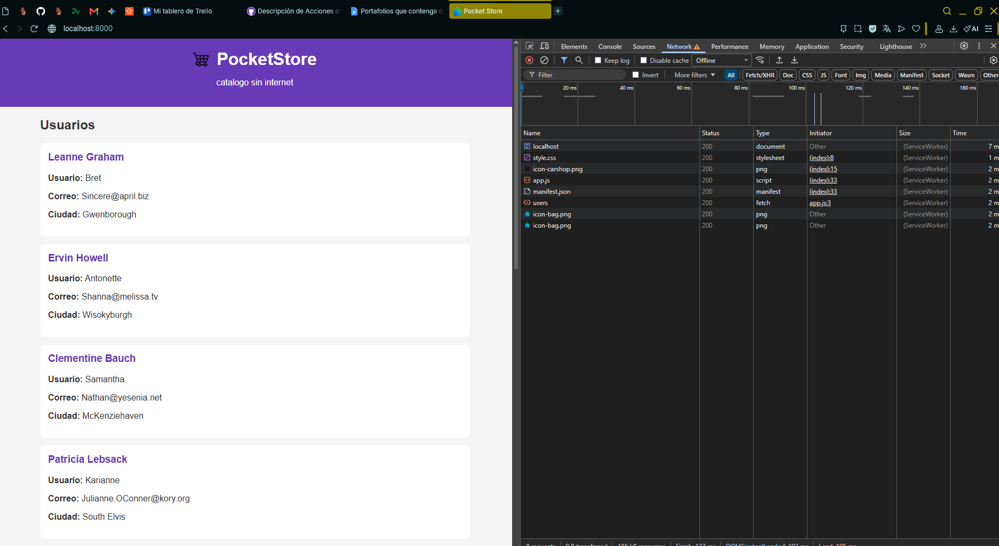
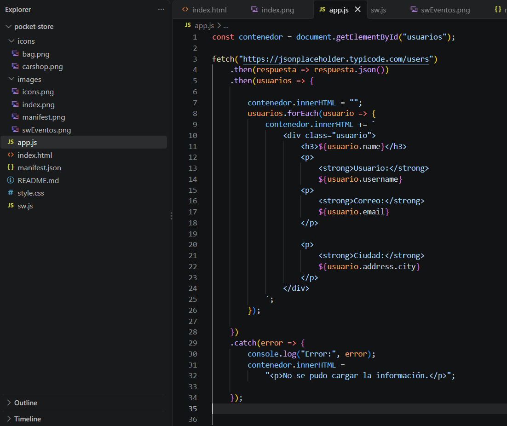

# Evidencia practica PocketStore

La practica consiste en crear una aplicación web que muestra un catálogo de usuarios que puede funcionar sin conexión a Internet después de haberse cargado al menos una vez.

## Pasos de implementación cada componente
### 1. El Manifiesto (manifest.json)

1. Crear el archivo JSON a mano.  
   Creé el archivo `manifest.json` dentro del proyecto para guardar la configuración principal de la aplicación.
   

2. Configurar el `name`, `short_name`, `start_url`, `display: "standalone"`, los colores corporativos y, de ser posible, dos iconos (ej. 192x192 y 512x512).  
   Agregué el nombre de la aplicación, el nombre corto, la página de inicio, el modo `standalone`, los colores y dos iconos de diferentes tamaños.
   

### 2. El App Shell (index.html y style.css)

1. Diseñar la estructura estática básica (barra superior con título, un contenedor principal y un pie de página).  
   En `index.html` hice la estructura principal de la página con un encabezado, el espacio donde se muestran los usuarios y un pie de página.
   

2. Asegurar que este diseño cargue instantáneamente y sirva como el contenedor visual fijo (la "Vista") mientras el contenido dinámico llega después.  

   Dejé la estructura principal lista desde el inicio y usé `style.css` para darle un diseño sencillo. Después los usuarios se cargan con JavaScript.
   

### 3. El Service Worker y la Caché (sw.js)

1. Programar el ciclo de vida del Service Worker (`install`, `activate`, `fetch`).  
   En `sw.js` agregué los eventos `install`, `activate` y `fetch`, que permiten instalar, activar y controlar las peticiones de la aplicación.

2. Implementar el evento `fetch`, para recuperar información.  
   En el evento `fetch` hice que la aplicación primero busque la información en caché y, si no está guardada, la obtenga desde Internet.
   
   

### 4. El Contenido Dinámico (app.js)

1. Consumir una API pública gratuita, como JSONPlaceholder, para obtener usuarios o productos usando `fetch()`.  
   En `app.js` utilicé `fetch()` para obtener usuarios desde JSONPlaceholder y después mostrarlos en la página.

### 5. Documentar el proyecto en un README.md

1. Incluir un directorio con imágenes que ilustren el proceso de desarrollo.  
   Cree una carpeta `images` para guardar capturas del proceso y del funcionamiento de la aplicación.

